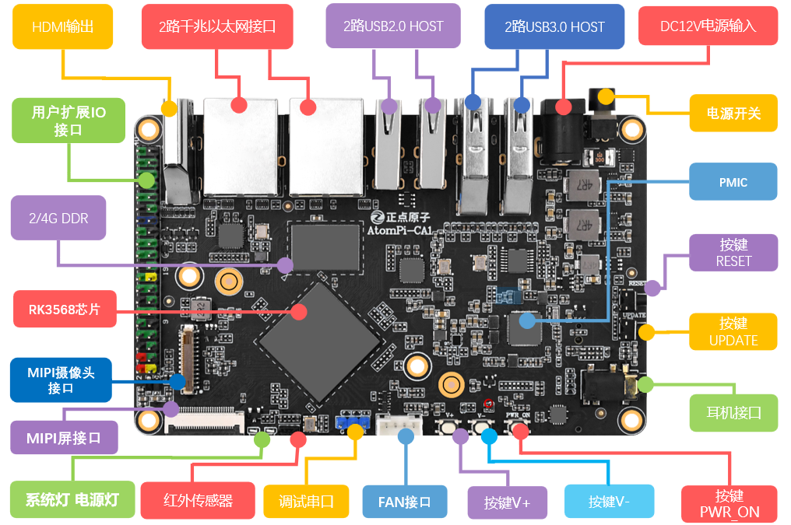
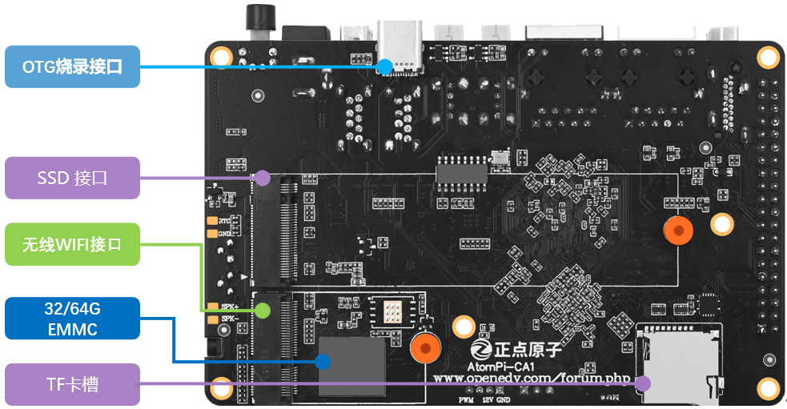

# 3.3 ATOMPI-CA1外设资源

&emsp;&emsp;ATOMPI-CA1资源十分丰富，内部大部分的资源都可以在此ATOMPI-CA1上验证，同时扩充丰富的接口和功能模块，整个ATOMPI-CA1显得十分大气。

 
图 3.3.1 ATOMPI-CA1正面资源图

 
图 3.3.2 ATOMPI-CA1背面资源图

&emsp;&emsp;从上面两张图片我们可以看到ATOMPI-CA1集成了大量的元器件以及丰富的接口接口，同时我们将ATOMPI-CA1的尺寸做到了115mm*72mm这样一个比较紧凑的大小。

&emsp;&emsp;正点原子ATOMPI-CA1资源如下： 
&emsp;&emsp;主芯片为RK3568 
&emsp;&emsp;LPDDR4X SDRAM芯片（容量为2GB或者4GB） 
&emsp;&emsp;EMMC 芯片（容量为32GB或者64GB） 
&emsp;&emsp;RK809-5 电源音频一体芯片 
&emsp;&emsp;HDMI接口（最高支持4K60帧） 
&emsp;&emsp;双千兆以太网口 
&emsp;&emsp;4个USB接口（2*3.0+2*2.0） 
&emsp;&emsp;TYPE-C接口（仅用于烧录固件以及调试） 
&emsp;&emsp;DC-12V供电接口 
&emsp;&emsp;电源开关，控制DC12V供电 
&emsp;&emsp;一个复位按键，用于复位卡片电脑 
&emsp;&emsp;一个UPDATE按键，用于卡片电脑烧录 
&emsp;&emsp;一个3.5mm耳机麦克风一体接口 
&emsp;&emsp;三个功能按键（音量加减以及RK809-5引出的PWR_ON按键） 
&emsp;&emsp;4P散热风扇接口 
&emsp;&emsp;3P调试串口接口 
&emsp;&emsp;红外接收传感器 
&emsp;&emsp;26P MIPI屏幕接口 
&emsp;&emsp;22P MIPI摄像头接口 
&emsp;&emsp;40P 扩展接口 
&emsp;&emsp;TF CARD卡座 
&emsp;&emsp;M.2 M-KEY SSD硬盘接口 
&emsp;&emsp;M.2 E-KEY WIFI/BT拓展卡接口

&emsp;&emsp;ATOMPI-CA1合理的安排接口布置并将尺寸缩小到如此的尺寸还保留了大量的接口，配合默认的Debian 系统固件可以让我们实现多种形态的应用场景。我们可以将其作为一个小型的便携电脑用于轻量化的办公场景。通过40P的拓展接口我们可以作为实现我们各种脑洞打开的想法基座。卡片电脑上预留的M.2接口可以外接更大容量的硬盘及WIFI模块，实现一个私人的小型NAS或者小型网关。

