# 1.2 串口软件安装

## 1.2.1 串口模块和卡片电脑相连

&emsp;&emsp;正点原子卡片电脑的调试串口是直接使用排针引出，可以直接是用USB转TTL串口模块直接连接。这里推荐使用正点原子的USB转串口模块ATK-MO340P。USB转串口的驱动安装方法可以参考对应模块网盘资料里面的用户手册。使用其他USB转串口模块需要注意调试串口的通信电平是3.3V的TTL电平不是RS232电平请不要将USB转RS232接到卡片电脑的调试串口上。

&emsp;&emsp;对应模块的驱动安装成功后，通过USB线将串口模块与电脑相连，再将卡片电脑的调试串口连接到串口模块上连接方式如图1.2.1.1所示：

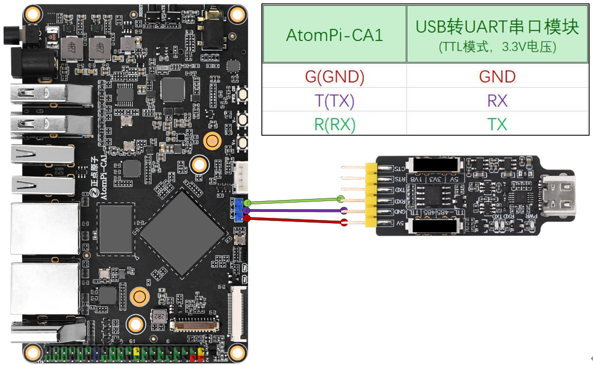 
图1.2.1.1 板卡调试串口与电脑相连

&emsp;&emsp;连接成功后，此时电脑会检测到一个USB转串口设备，打开Windows设备管理器：

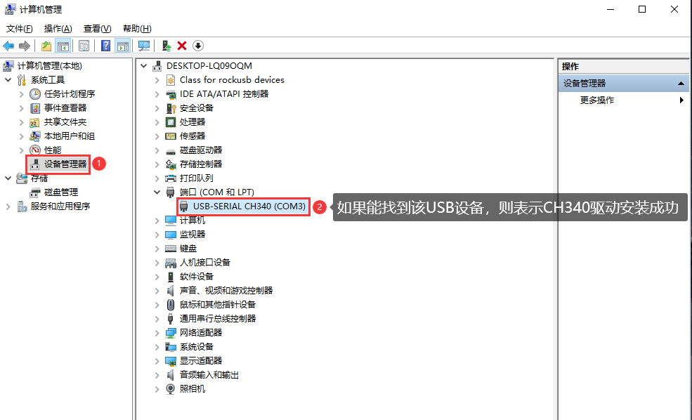 
图1.2.1.2 Windows设备管理器

&emsp;&emsp;如果在“**设备管理器端口（COM和LPT）**”下能找到一个名为“**USB-SERIAL CH340**”的设备，则表示CH340驱动安装成功！如果找不到名为“**USB-SERIAL CH340**”的设备，请用户自行检查硬件连接是否有误！可拔掉USB线、重新连接，或者连接电脑的其它USB口试试。

## 1.2.2 MobaXterm软件安装

&emsp;&emsp;MobaXterm是一款多功能远程终端软件，功能强大、而且免费（也有收费版本），支持创建SSH、Telnet、Rsh、Xdmc、RDP、VNC、FTP、SFTP、串口(Serial COM)等超多远程连接功能。MobaXterm提供了人性化的操作界面，功能十分强大，所以推荐用户使用MobaXterm这款终端软件。

&emsp;&emsp;**1、MobaXterm软件下载**

&emsp;&emsp;板卡资料包中已经给用户提供了MobaXterm软件安装包，路径为：**开发板光盘A盘-基础资料->04、辅助软件->MobaXterm_Installer_v12.3.zip**；用户也可以通过链接地址：https://mobaxterm.mobatek.net/download.html，自己下载：

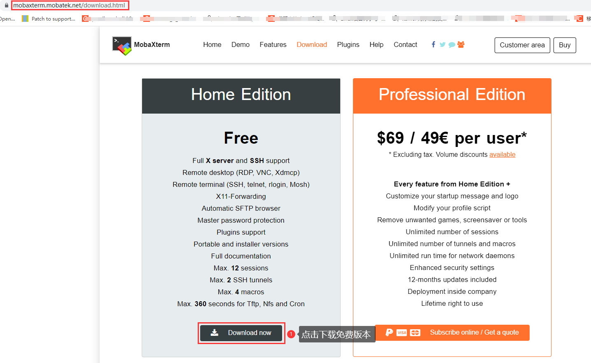 
图1.2.2.1 下载MobaXterm软件(1)

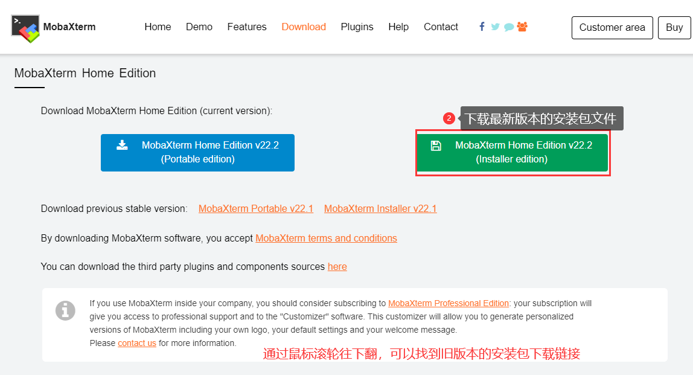 
图1.2.2.2 下载MobaXterm软件(2)

&emsp;&emsp;下载完成后会得到一个名为MobaXterm_Installer_vxxx.zip的压缩包文件（xxx为版本号），目前最新版本为22.2，资料包中给用户提供的安装包对应的版本为12.3，用新的版本也行，旧的版本也可以，这个都没什么关系，这里我们以12.3版本为例。

&emsp;&emsp;**2、MobaXterm软件安装**

&emsp;&emsp;将MobaXterm_Installer_v12.3.zip压缩包文件解压，解压之后如图所示：

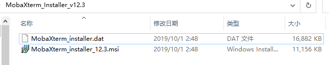 
图1.2.2.3 MobaXterm_Installer_v12.3.zip解压后的文件

&emsp;&emsp;接着双击运行MobaXterm_Installer_v12.3.msi文件，按照图1.2.2.4~1.2.2.8所示步骤安装MobaXterm软件：

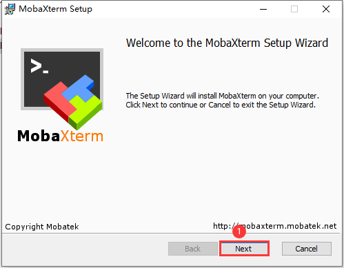 
图1.2.2.4 安装MobaXterm软件(1)

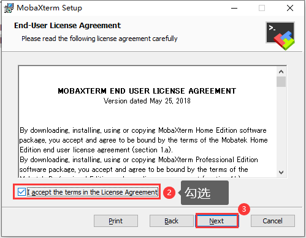 
图1.2.2.5安装MobaXterm软件(2)

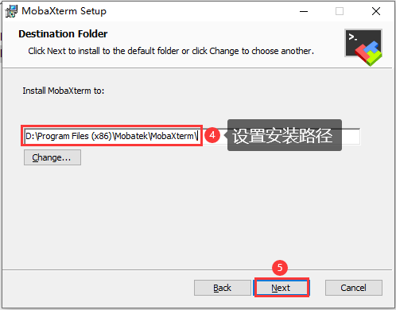 
图1.2.2.6 安装MobaXterm软件(3)

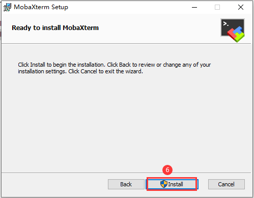 
图1.2.2.7 安装MobaXterm软件(4)

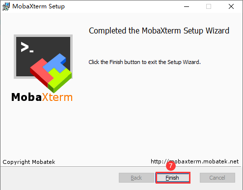 
图1.2.2.8 安装MobaXterm软件(5)

&emsp;&emsp;至此，软件安装完成，桌面会自动生成MobaXterm软件快捷方式图标：

 
图1.2.2.9 MobaXterm软件桌面图标

## 1.2.3 MobaXterm软件的串口使用

&emsp;&emsp;双击MobaXterm桌面图标打开该软件，如图1.2.3.1所示：

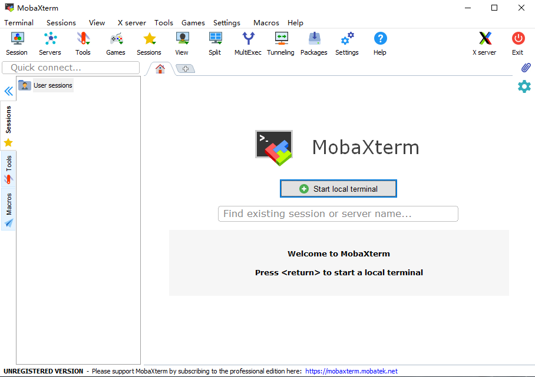 
图1.2.3.1 MobaXterm软件主界面

&emsp;&emsp;接下来向大家介绍如何建立Serial（串口）连接以及ssh远程连接。

&emsp;&emsp;**1. 串口连接**

&emsp;&emsp;卡片电脑上有一个调试串口，可直接通过USB线将其连接到电脑。串口作为嵌入式设备最为常见的通信接口之一，不但能实现计算机与嵌入式设备之间的数据传输，而且还能实现计算机对嵌入式设备的控制，嵌入式开发过程中，通常将其作为调试接口（串口调试），用于调试嵌入式设备。

&emsp;&emsp;开发过程中我们与卡片电脑信息交互，一般是通过串口，当然可以通过网络。网络得先知道卡片电脑的ip。所以此时串口十分重要。

&emsp;&emsp;1、将串口模块一端连接电脑，另外一端连接卡片电脑的引脚G(GND)、R(RX)、T(TX)上。连接示意图如下：

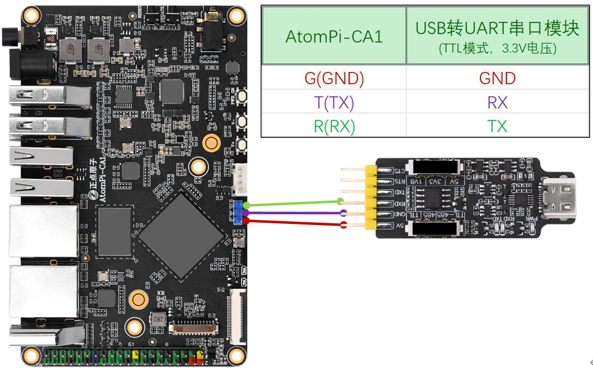 
图1.2.3.2 连接图

&emsp;&emsp;**串口模块模式选择TTL模式，电压选择3.3V模式。**

&emsp;&emsp;按照图1.2.3.3 ~ 1.2.3.5所示操作步骤建立一个Serial（串口）连接（**在建立连接之前，需要通过USB线将卡片电脑的调试串口与电脑相连、并且已经安装了CH340驱动**）：

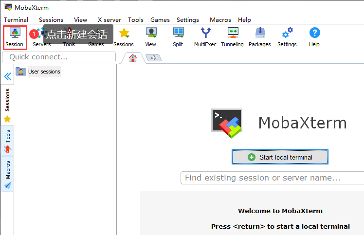 
图1.2.3.3 建立串口连接(1)

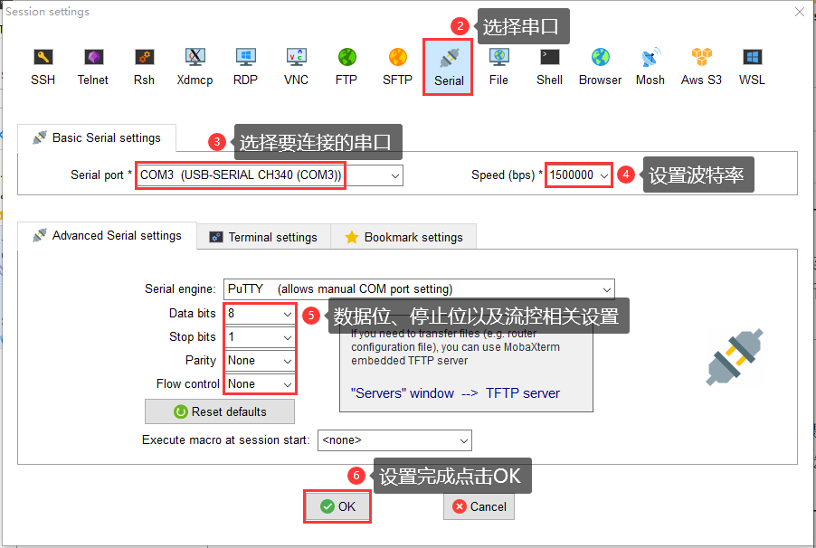 
图1.2.3.4 建立串口连接(2)

&emsp;&emsp;首先选择需要进行连接的串口，确保卡片电脑的调试串口与电脑已经通过USB线相连、并且CH340驱动已经安装成功（“**设备管理器端口（COM和LPT）**”下能找到一个名为“**USB-SERIAL CH340**”的设备），那么MobaXterm软件才能识别到卡片电脑的调试串口，我们便可以在“Serial port”下拉列表中找到卡片电脑对应的串口（**USB-SERIAL CH340**），然后选择它即可！

&emsp;&emsp;接着设置串口通信波特率，根据实际情况进行设置，RK3568平台的调试串口，其默认波特率为1500000（15M）；然后设置数据位、停止位以及流控等，设置完成后点击“**OK**”按钮。

&emsp;&emsp;Serial连接就建立成功了，如图1.2.3.5所示：

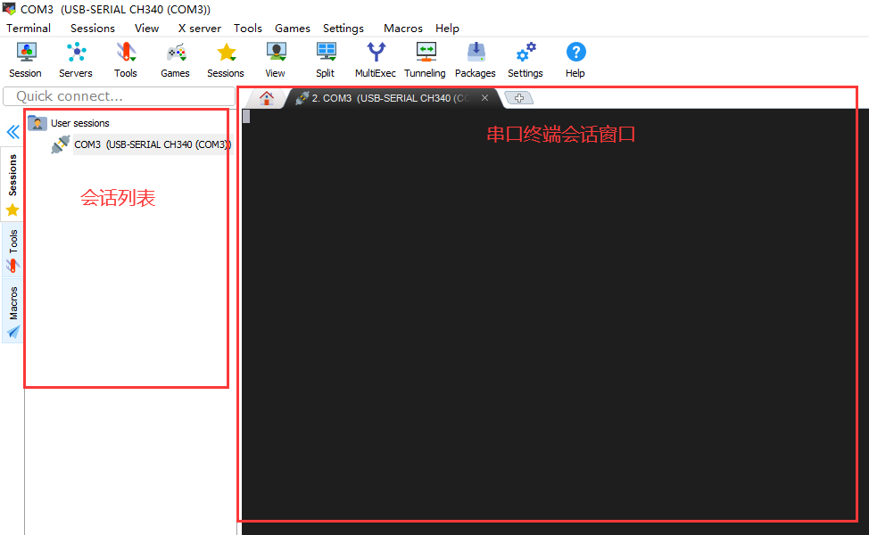 
图1.2.3.5 建立串口连接(3)

&emsp;&emsp;打开电源开关，上电，预装的系统为debian系统。串口输出的信息如下。

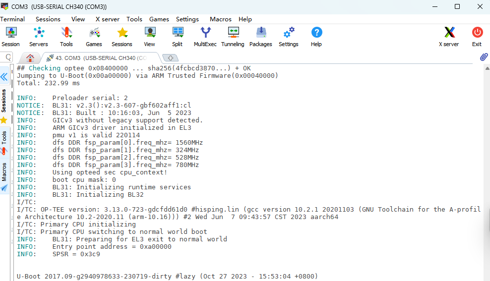 
图1.2.3.6 串口打印日志

## 1.2.4 MobaXterm软件的SSH使用

&emsp;&emsp;接下来介绍如何建立ssh远程连接，通过ssh可以实现远程登录卡片电脑的debian系统；按照图1.2.4.1 ~ 1.2.4.5所示操作步骤建立ssh远程连接、实现远程登录操作：

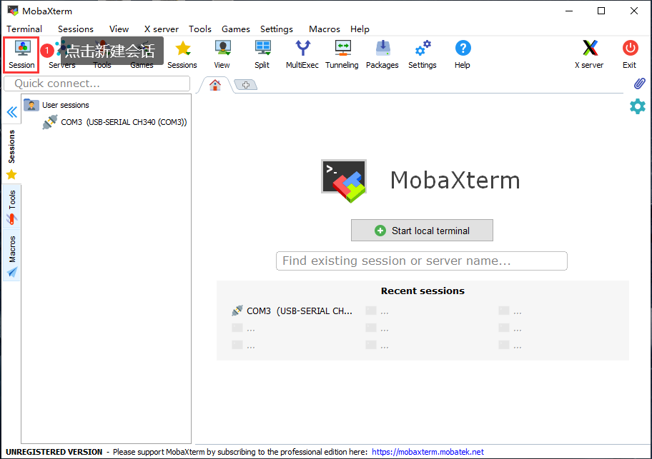 
图1.2.4.1建立ssh远程连接(1)

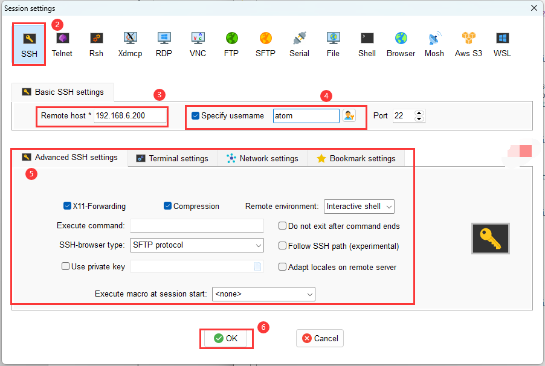 
图1.2.4.2 建立ssh远程连接(2)

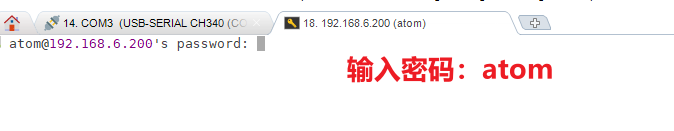 
图1.2.4.3 建立ssh远程连接(3)

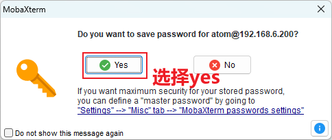 
图1.2.4.4建立ssh远程连接(4)

&emsp;&emsp;弹出窗口询问用户是否需要保存密码，我们可以选择“Yes”保存密码、也可以选择“No”不保存，取决于个人。至此，ssh远程连接就创建成功了，如图2.7.3.9所示：

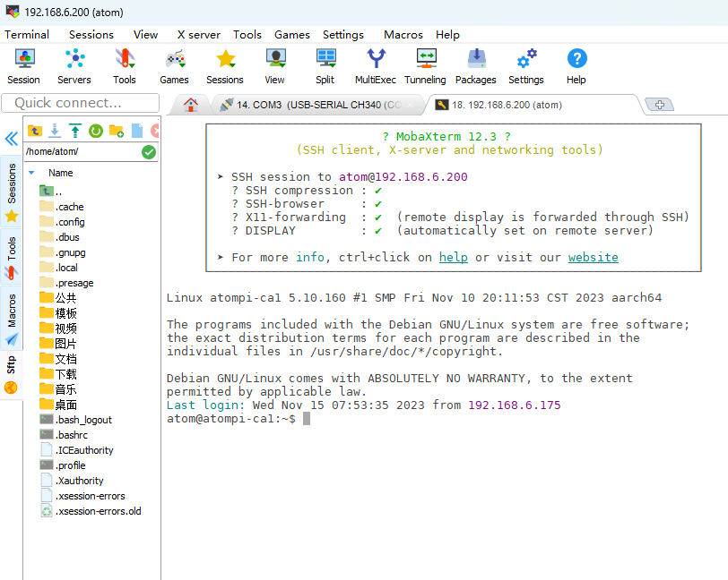 
图1.2.4.5 ssh远程登录成功

&emsp;&emsp;在ssh远程登录的情况下，我们也可通过MobaXterm软件来实现Windows与Ubuntu之间的文件互传（通过sftp协议进行文件传输）。

