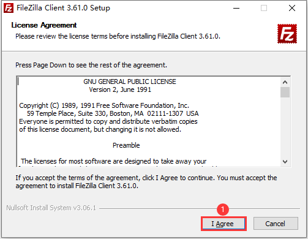
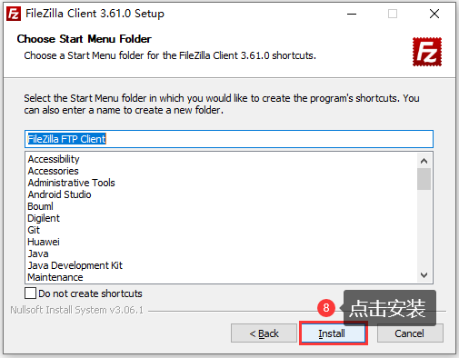

# 1.3 Windos下安装SFTP客户端

&emsp;&emsp;我们需要在Windows系统下安装一个FTP客户端软件，这里选择FileZilla作为FTP客户端软件，这是一个免费的FTP客户端软件。

&emsp;&emsp;卡片电脑资料包中已经给用户提供了FileZilla软件安装包，路径为：**开发板光盘A盘-基础资料->04、软件->FileZilla_3.61.0_win64-setup.exe**，用户也可以通过链接地址：https://www.filezilla.cn/download/client， 自己下载安装包文件。

 
图1.3.1 下载FileZilla软件安装包

&emsp;&emsp;下载完成如图1.3.2所示：

 
图1.3.2 FileZilla软件安装包

&emsp;&emsp;接着双击安装包文件FileZilla_3.61.0_win64-setup.exe，按照图1.3.3 ~ 1.3.8所示步骤进行安装：

 
图1.3.3 安装FileZilla软件(1)

 
图1.3.4 安装FileZilla软件(2)

 
图1.3.5 安装FileZilla软件(3)

 
图1.3.6 安装FileZilla软件(4)

 
图1.3.7 安装FileZilla软件(5)

 
图1.3.8 安装FileZilla软件(6)

&emsp;&emsp;至此，软件安装完成，桌面会生成对应的快捷方式：

## 1.3.1 FileZilla使用方法

&emsp;&emsp;接下来介绍一下FileZilla的使用方法，首先双击FileZilla桌面图标打开该软件：

 
图1.3.1.1 FileZilla软件界面

&emsp;&emsp;卡片电脑作为FTP服务器，Windows作为FTP客户端，在进行文件传输之前，客户端需要先连接到服务器。按照图1.3.1.2~1.3.1.7所示步骤连接FTP服务器：

 
图1.3.1.2 FTP客户端连接FTP服务器(1)

 
图1.3.1.3 FTP客户端连接FTP服务器(2)

 
图1.3.1.4 FTP客户端连接FTP服务器(3)

 
图1.3.1.5 FTP客户端连接FTP服务器(4)

 
图1.3.1.6 FTP客户端连接FTP服务器(5)

&emsp;&emsp;连接成功如图1.3.1.7所示：

 
图1.3.1.7 连接成功

&emsp;&emsp;客户端成功连接上服务器成功后，便可以进行文件传输了。传输的方式也非常简单，选择要传输的文件，直接使用鼠标左键将其拖动到 Windows 目录区域或者 卡片电脑系统目录区域即可！比如，将 Windows 系统下的 test.txt 文件拷贝到卡片电脑系统，首先在左侧 Windows 目录区域找到该文件 test.txt，然后使用鼠标左键将其拖动至右边卡片电脑目录区域释放即可；同理，卡板系统下的文件拷贝到 Windows 系统也是如此！

