# 1.4 ADB的安装和使用

## 1.4.1 ADB命令安装

&emsp;&emsp;ADB命令的全称为“Android Debug Bridge”，从英文中看出主要是用作安卓的调试工具。ADB命令在嵌入式开发中越来越常用了，在AtomPi-CA1上OTG默认当作ADB功能(可以做复用其它功能)，所以我们要在Windows上安装ADB工具(linux 已经通过命令安装成功了)，安装包已经放到了卡片电脑光盘，路径为：**开发板光盘A-基础资料->4、软件-> platform-tools_r33.0.3-windows.zip**。解压到自定义的安装目录。接着我们在Windows上按“win”+“R”组合件打开运行，结果如下所示：


<center>
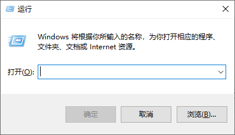<br />
图1.4.1.1 Windows10的运行
</center>

&emsp;&emsp;打开运行后，输入sysdm.cpl，按回车就会打开系统属性，如下图所示：

<center>
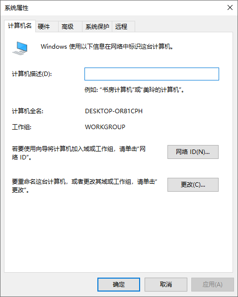<br />
图1.4.1.2 系统属性
</center>

&emsp;&emsp;点击图1.4.1.2中的“高级”，进入环境变量设置界面，如下图所示：

<center>
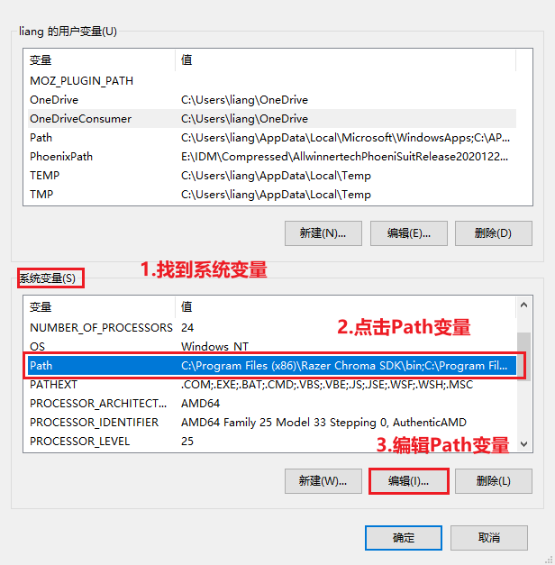<br />
图1.4.1.3 环境变量
</center>

&emsp;&emsp;接着我们可以把ADB的路径添加到系统变量里面，根据上图的步骤操作进入“Path”变量路径添加，如下图所示：

<center>
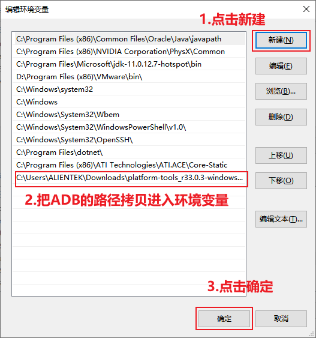<br />
图1.4.1.4 Path编辑环境变量
</center>

&emsp;&emsp;根据上图1.4.1.4步骤把ADB的路径添加到Path系统环境变量里面(**最好要点击两次确认**)，这里笔者的路径为：C:\Users\ALIENTEK\Downloads\platform-tools_r33.0.3-windows\platform-tools。运行CMD终端，输入命令进行检验是否安装成功。命令如下所示：

```c#
adb --version
```

&emsp;&emsp;显示结果如下所示：

<center>
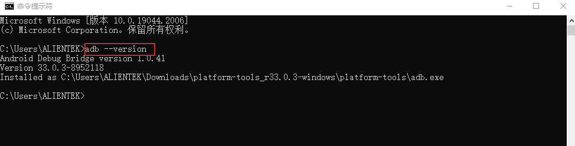<br />
图1.4.1.5 adb版本验证
</center>

## 1.4.2 adb连接卡片电脑设备

&emsp;&emsp;卡片电脑运行 Debian 系统，通过 USB 线将卡片电脑的 USB OTG 接口（卡片电脑上的type-c接口）连接到 PC 上（只支持 USB OTG 接口），连接方式如图 1.4.2.1 所示。默认情况下，设备会连接到 Windows系统，此时打开 Windows 设备管理器会找到一个名为“**Android ADB Interface**”的设备，如图 1.4.2.1 所示：

&emsp;&emsp;注意：假如重新插拔USB OTG还是不能发现设备，建议是重启一下卡片电脑。debian系统和adb服务程序存在不是很兼容的情况，后续看情况优化一下该功能。目前版本更推荐使用ssh连接。

<center>
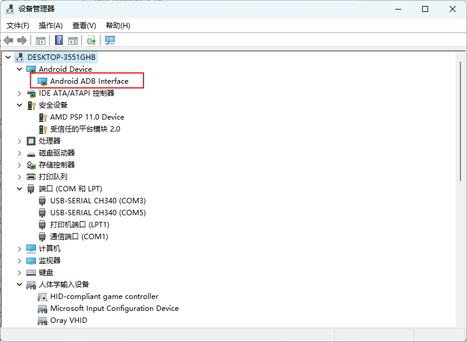<br />
图1.4.2.1 Android Device接口
</center>

&emsp;&emsp;在Windows下打开cmd命令行窗口，执行“adb devices”查看当前连接的设备：

<center>
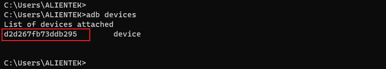<br />
图1.4.2.2 运行shell
</center>

&emsp;&emsp;表示adb server已经和设备“d2d267fb73ddb295”建立了连接。

## 1.4.3 运行shell

&emsp;&emsp;在Windows下执行“adb shell”命令可以运行设备的shell（命令行终端），如下所示：

<center>
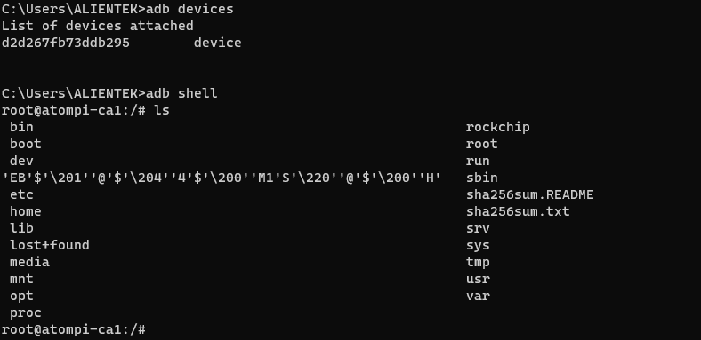<br />
图1.4.3.1 查看当前连接的设备
</center>

&emsp;&emsp;可执行exit退出shell。

## 1.4.4 文件传输

&emsp;&emsp;通过“adb push”命令可以将本地文件内拷贝至设备：

```c#
adb push local remote
```

&emsp;&emsp;local表示本地文件，remote表示远端设备的某个目录，将本地文件拷贝至远端设备的某个目录下，譬如：

```c#
adb push .\led.bin /
```

<center>
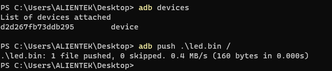<br />
图1.4.4.1 Windows下拷贝文件至设备
</center>

<center>
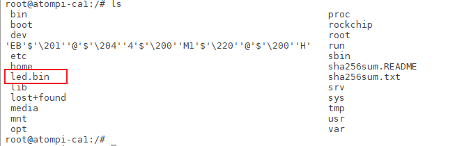<br />
图1.4.4.2 查看设备下的目录
</center>

&emsp;&emsp;反过来，也可以通过“adb pull”命令将设备中的文件拷贝至Windows下：

```c#
adb pull remote local
```

&emsp;&emsp;remote表示远端设备的某个文件，local表示Windows某个目录，将远端设备的某个文件拷贝至Windows下，譬如：


<center>
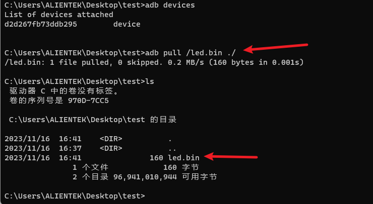<br />
图1.4.4.3 将设备中的文件拷贝至本地
</center>


