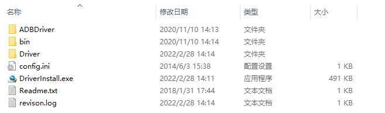
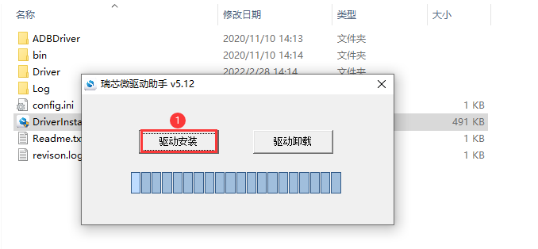
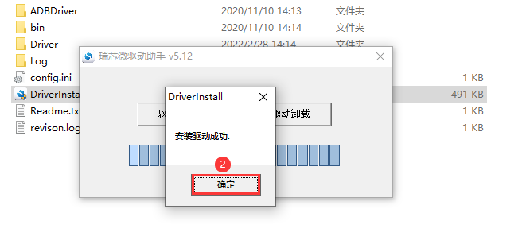
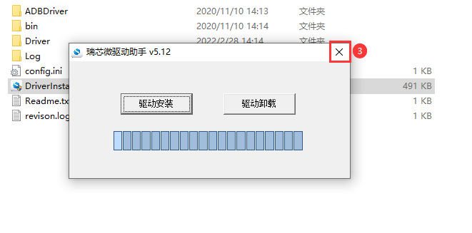

# 2.1 Rockchip USB驱动安装

&emsp;&emsp;在开发调试阶段，经常需要将设备切换至Loader模式或者Maskrom模式，譬如使用瑞芯微开发工具（RKDevTool）烧录镜像时（需连接USB线），设备需要工作在Loader模式或Maskrom模式，此时才可进行烧写；需要在Windows下安装Rockchip USB驱动才能识别到设备。

&emsp;&emsp;卡片电脑资料包中已经给用户提供了Rockchip USB驱动安装包，路径为：**开发板光盘A盘-基础资料->05、系统镜像->烧录工具->DriverAssitant_v5.12.zip**，支持xp、win7_32、win7_64、win10_32、win10_64等操作系统；将DriverAssitant_v5.12.zip压缩文件解压，解压之后得到如图2.1.1所示文件、目录列表：

 
图2.1.1 DriverAssitant_v5.12.zip解压

&emsp;&emsp;直接双击DriverInstall.exe文件，按照图2.8.2~2.8.4所示步骤安装Rockchip USB驱动：

 
图2.1.2 安装Rockchip USB驱动(1)

 
图2.1.3 安装Rockchip USB驱动(2)

 
图2.1.4 安装Rockchip USB驱动(3)

