# 2.2 镜像烧录工具的使用

&emsp;&emsp;本小节简单介绍下Windows下的烧写工具RKDevTool，在我们开发调试过程中，这个应该是使用最多的烧写工具。

## 2.2.1 烧写模式介绍

&emsp;&emsp;Rockchip平台硬件设备运行的几种模式如下表所示，只有当设备处于Maskrom以及Loader模式时（**必须要通过USB线将板卡的OTG口连接到电脑**），才能够烧写镜像，或对板上镜像进行更新操作。

| **模式**        | **是否支持烧录** | **描述**                                                     |
| :-------------: | :--------------: | ------------------------------------------------------------ |
| **Maskrom**     | 支持             | Flash在未烧录镜像时，芯片会引导进入Maskrom模式，可以进行初次镜像的烧写；开发调试过程中若遇到无法正常进入Loader模式的情况，也可进入Maskrom模式烧写镜像。 |
| **Loader**      | **支持**         | **Loader****模式下可以进行镜像烧写、更新升级，可以通过烧写工具单独烧写某一个分区镜像文件，方便调试。** |
| **Normal Boot** | 不支持           | 系统正常启动进入该模式，通过引导rootfs启动，加载rootfs根文件系统，大多数的开发都是在这个模式下进行的。 |

&emsp;&emsp;进入Maskrom烧写模式的方法：（先连接电源适配器和OTG） 
&emsp;&emsp; - 卡片电脑未烧录过镜像，上电之后就会进入到Maskrom模式； 
&emsp;&emsp; - 卡片电脑烧录过镜像，按住卡片电脑上的**UPDATE按键**，然后卡片电脑上电或复位，系统将会进入到Maskrom模式； 
&emsp;&emsp; - 卡片电脑烧录过镜像，在U-Boot命令行下，执行“**rbrom**”命令进入到Maskrom模式。

&emsp;&emsp;进入Loader烧写模式的方法：（先连接电源适配器和OTG） 
&emsp;&emsp; - 卡片电脑烧录过镜像，按住**V+按键**（音量+）按键，然后卡片电脑上电或复位，系统将会进入到Loader模式； 
&emsp;&emsp; - 卡片电脑烧录过镜像，在U-Boot命令行下，执行“**download**”命令进入到Loader模式； 
&emsp;&emsp; - 卡片电脑烧录过镜像，在Linux系统下，通过串口或ADB执行命令“**reboot loader**”重启进入到Loader模式；

&emsp;&emsp;以上给大家介绍了卡片电脑如何进入到Maskrom或Loader烧写模式，只有进入Maskrom模式或Loader模式后才可进行烧录。

## 2.2.2 Windows下RKDevTool工具的使用

&emsp;&emsp;在Windows下烧写镜像使用RKDevTool工具，RK的文档中一般也将其称为瑞芯微开发工具，该工具除了用于烧录镜像之外，还有其它的一些功能，是我们开发、调试过程中最常用的工具。
	
&emsp;&emsp;卡片电脑资料包中已经给用户提供了该工具，路径为：**开发板光盘A盘-基础资料->05、系统镜像->烧录工具-> RKDevTool_Release_v2.92.zip**，当然该工具在RK3568 SDK中也可以找到。

&emsp;&emsp;首先将RKDevTool_Release_v2.92.zip压缩文件解压开来，解压之后的内容如下所示：

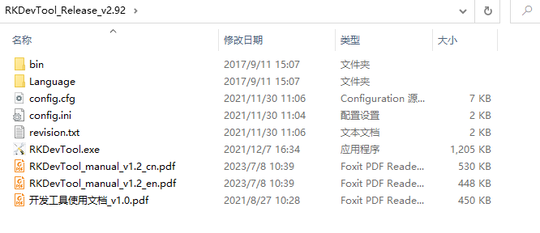 
图2.2.2.1 RKDevTool目录

&emsp;&emsp;该目录下有两份文档：《开发工具使用文档_v1.0.pdf》和《RKDevTool_manual_v1.2_cn.pdf》，这两份文档向用户介绍了如何使用RKDevTool工具（瑞芯微开发工具），它们由RK官方提供；关于RKDevTool工具的详细使用方法请参考这两份文档，本文档只做一个简单的介绍。

&emsp;&emsp;双击**RKDevTool.exe**可执行文件打开瑞星微开发工具，如下图所示：

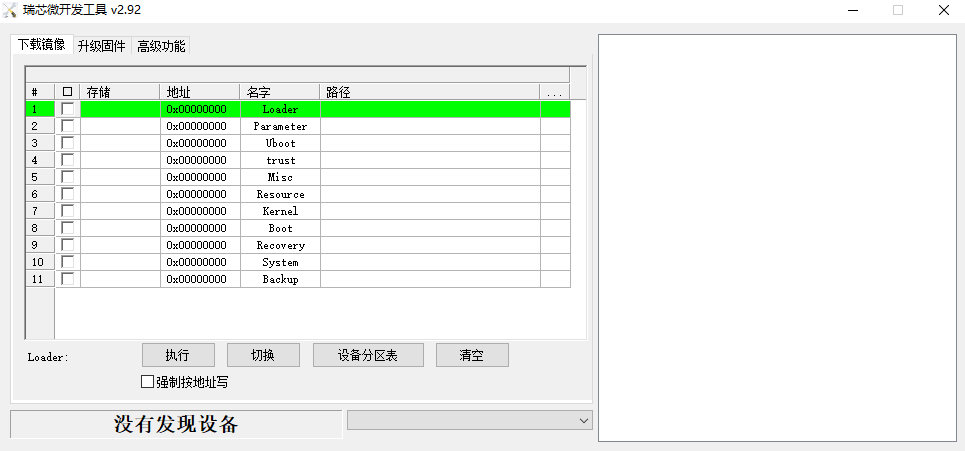 
图2.2.2.2 瑞星微开发工具界面

&emsp;&emsp;上图便是瑞芯微开发工具的一个主界面，RKDevTool工具有两种镜像烧录方式：

&emsp;&emsp; - **单独烧录各镜像**。资料中提供各种编译好的镜像，包括：boot.img、MiniLoaderAll.bin、uboot.img、rootfs.img、共计4个镜像文件，其中还包括一个分区表文件parameter.txt；使用RKDevTool工具可单独烧录这些镜像。 
&emsp;&emsp; - **烧录完整update.img固件**。update.img并非编译得到，它其实是由多个镜像打包而成，包括boot.img、MiniLoaderAll.bin、uboot.img、rootfs.img等，是这些分立镜像的集合体，通过RK提供的工具可将各个分立镜像打包成一个update.img固件包。

&emsp;&emsp;接下来讲一下如何烧录各个分立镜像，2.2.3小节将向用户介绍如何烧录update.img固件。

&emsp;&emsp;按照图2.2.2.4 ~ 2.2.2.7所示操作步骤，导入一个.cfg配置文件（配置文件中包含了烧录时的配置信息，包括镜像烧录地址、镜像所在路径等信息，当然也可自己手动配置这些信息，后面会讲）：

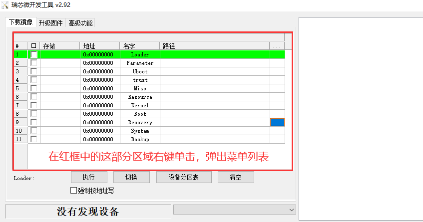 
图2.2.2.4 导入配置文件(1)

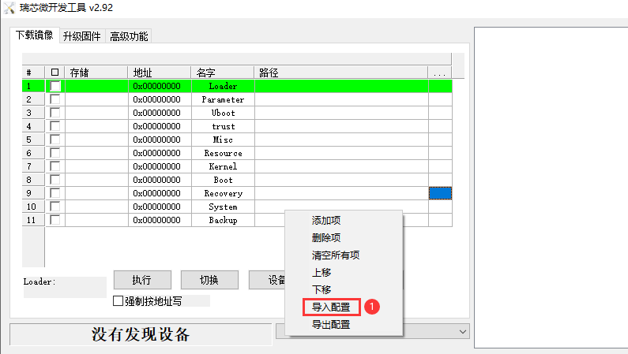 
图2.2.2.5 导入配置文件(2)

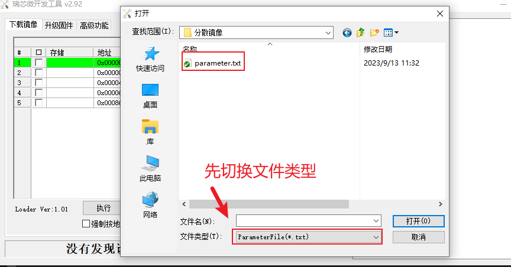 
图2.2.2.6 导入配置文件(3)

&emsp;&emsp;配置文件路径：开发板光盘A盘-基础资料\05、系统镜像\分散镜像\parameter.txt。

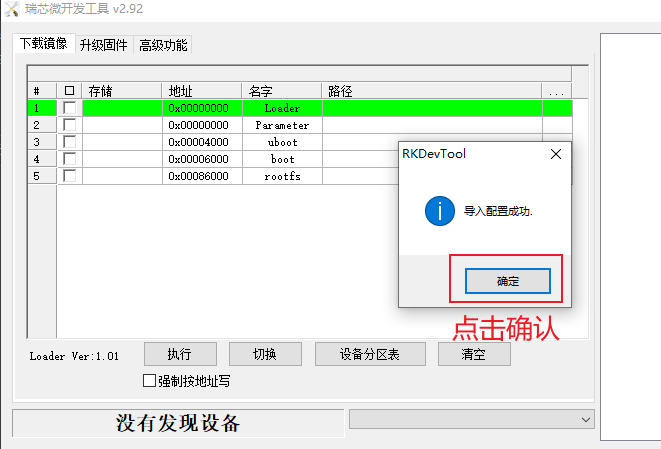 
图2.2.2.7 导入配置文件(4)

&emsp;&emsp;至此，我们就导入了一个烧录配置文件（导入配置文件）。

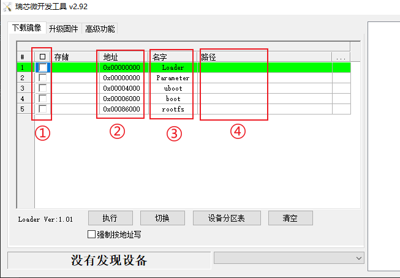 
图2.2.2.8 配置信息划分说明

&emsp;&emsp;①部分用于控制是否烧写对应的镜像，勾选表示需要烧写、不勾选表示不烧写； 
&emsp;&emsp;②部分表示烧写的地址（也就是镜像的烧录地址）； 
&emsp;&emsp;③部分表示该烧录项的名字； 
&emsp;&emsp;④部分用于指定镜像的所在路径。

&emsp;&emsp;这些配置信息都是可以手动进行更改的，改完之后可以重新导出到配置文件中进行保存，方便下次导入该配置。

&emsp;&emsp;对应的镜像文件在**开发板光盘A盘-基础资料\05、系统镜像\分散镜像\对应的文件名**。

&emsp;&emsp;导入配置后， 如下图所示：

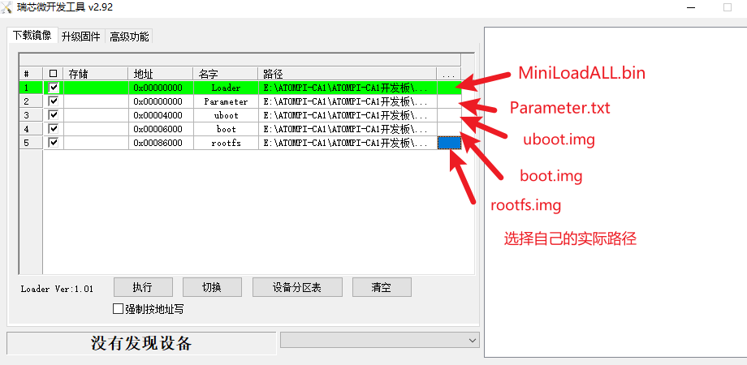 
图2.2.2.9 配置信息划分说明

&emsp;&emsp;接下来便可以进行烧写了，执行烧写操作之前，**卡片电脑必须处于Maskrom模式或Loader模式，客户拿到手的卡片电脑默认都是烧录过镜像的，可以进入到Loader模式，当然也可以进入到Maskrom模式。首先卡片电脑需要先连接电源线以及OTG口**，如下图所示：

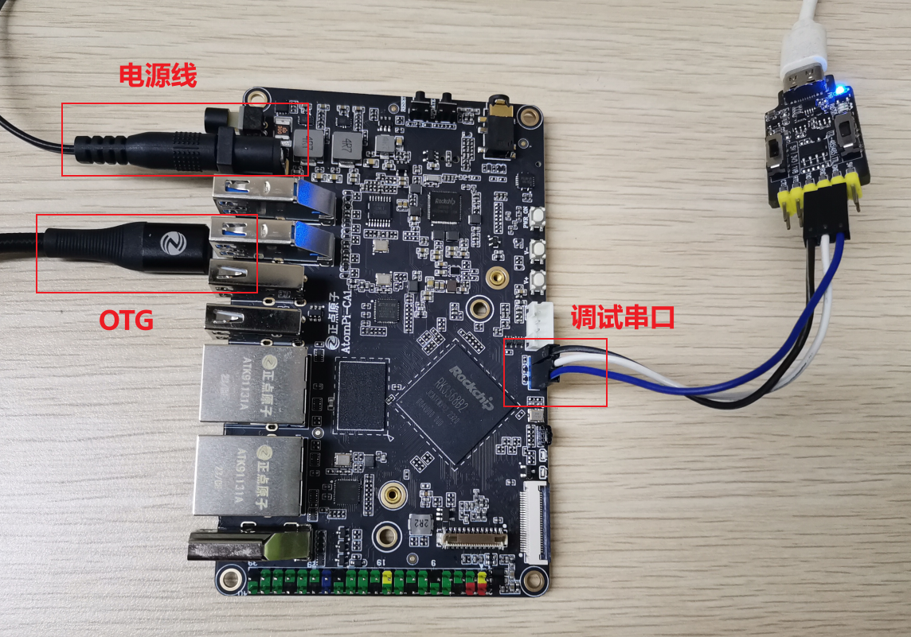 
图2.2.2.10 卡片电脑硬件连接示意图

&emsp;&emsp;建议使用卡片电脑配套的12-1A电源适配器；通过USB线（一端为USB接口、另一端为Type-C接口）将卡片电脑的UART调试串口连接到电脑，同样使用USB线（一端为USB接口、另一端为Type-C接口）将卡片电脑的OTG口连接到电脑。

&emsp;&emsp;硬件连接好之后，按住卡片电脑的**V+**（音量+）按键，然后卡片电脑上电或复位，系统将会进入到Loader模式；此时瑞芯微开发工具便会显示“**发现一个LOADER设备**”字样：

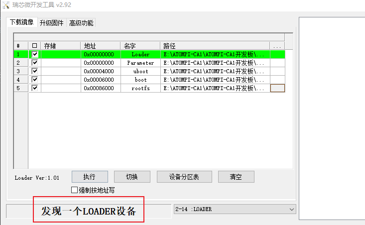 
图2.2.2.11 瑞芯微开发工具检测到loader设备

&emsp;&emsp;表示卡片电脑当前处于Loader模式，直接点击“执行”按钮即可开始烧写镜像，如下所示：

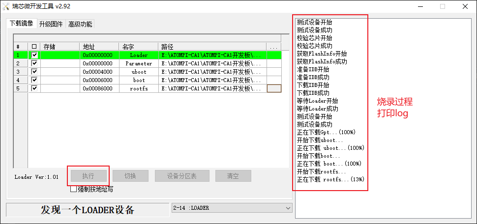 
图2.2.2.12 执行烧写操作

&emsp;&emsp;当然也可以在Maskrom模式下烧写，2.9.1小节中已经介绍了如何进入Maskrom模式，进入Maskrom模式后，同样也是点击“**执行**”按钮进行烧写。

&emsp;&emsp;如果没有出现意外，那么烧写将会成功，**也就意味着这些镜像已经成功烧写到了卡片电脑Flash存储器中（卡片电脑使用了eMMC作为板载存储器，所以默认情况下镜像会烧录到卡片电脑eMMC中，然后可以通过eMMC启动卡片电脑**）；如果不幸，烧写过程中出现了错误、导致烧写失败，那么大家可以参考RK官方提供的文档《**RKDevTool_manual_v1.2_cn.pdf**》，该文档中有针对几种常见的错误进行说明。

&emsp;&emsp;烧录完成后，会自动重启卡片电脑，通过MobaXterm软件连接卡片电脑的调试串口，可以查看系统启动过程中的log信息。

## 2.2.3 update.img镜像的烧录方法

&emsp;&emsp;update.img是多个镜像的集合体（由多个镜像打包合并而成），使用RK提供的工具可以将各个分立镜像（譬如uboot.img、boot.img、MiniLoaderAll.bin、parameter.txt、misc.img、rootfs.img、oem.img、userdata.img、recovery.img）打包成一个update.img固件，方便用户烧录、升级。

&emsp;&emsp;本小节介绍如何使用瑞芯微开发工具烧写update.img，首先打开瑞芯微开发工具，选择“**升级固件**”：

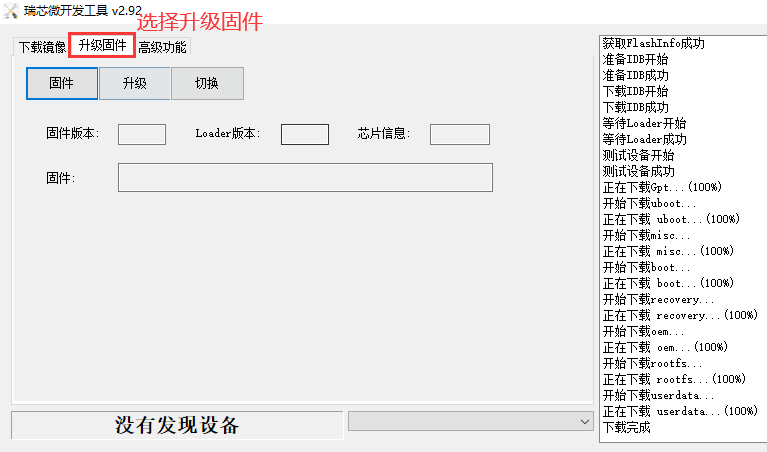 
图2.2.3.1 升级固件选项卡

&emsp;&emsp;然后点击“**固件**”按钮选择我们需要进行升级、烧录的update.img固件，位置在**开发板光盘A盘-基础资料\05、系统镜像\update镜像**，导入update.img固件之后会显示该固件的一些信息：

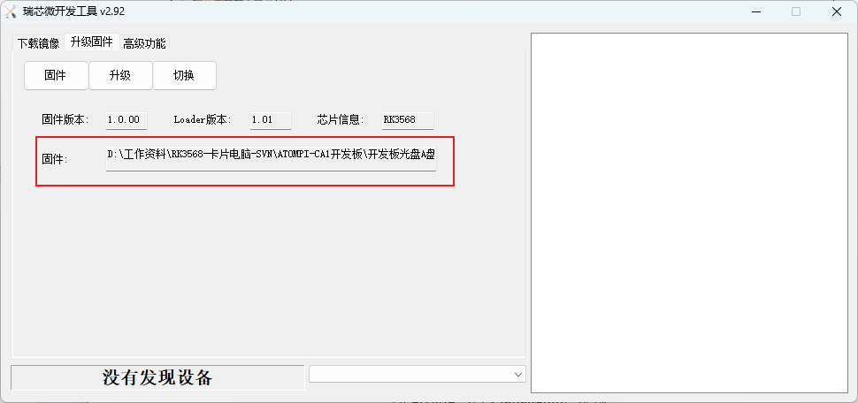 
图2.2.3.2 导入update.img镜像

&emsp;&emsp;首先让设备进入Maskrom或Loader模式，然后点击“**升级**”按钮进行固件升级、更新：

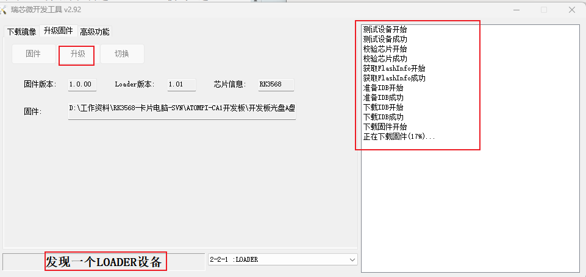 
图2.2.3.3 update.img升级

&emsp;&emsp;固件烧录完成后，会自动重启卡片电脑。

## 2.2.4 擦除操作

&emsp;&emsp;通过瑞芯微开发工具可以擦除Flash，将烧录到Flash中的镜像擦除。打开瑞芯微开发工具，点击“**高级功能**”选项卡，如下所示：

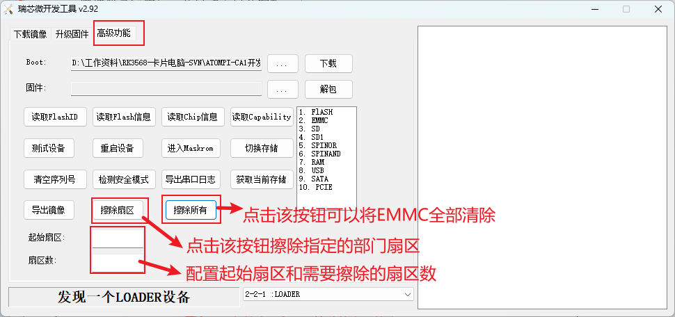 
图2.2.4.1 高级功能页面

&emsp;&emsp;需要注意，擦除操作需要在Loader模式下进行（ Maskrom 模式也可以执行擦除操作，但需要先下载MiniLoaderAll.bin，首先选择MiniLoaderAll.bin镜像，然后点击上图中的“ **下载** ”按钮执行下载操作，详情请参考< 开发工具使用文档_v1.0.pdf >文档）。点击“**擦除所有**”按钮可以将卡片电脑eMMC中的数据全部擦除；点击“**擦除扇区**”按钮可以擦除用户指定的部分扇区，将擦除的起始扇区填写至“**起始扇区**”输入框，将需要擦除的总扇区数填写至“**扇区数**”输入框即可。

&emsp;&emsp;譬如点击“擦除所有”按钮来擦除卡片电脑eMMC中的全部数据：

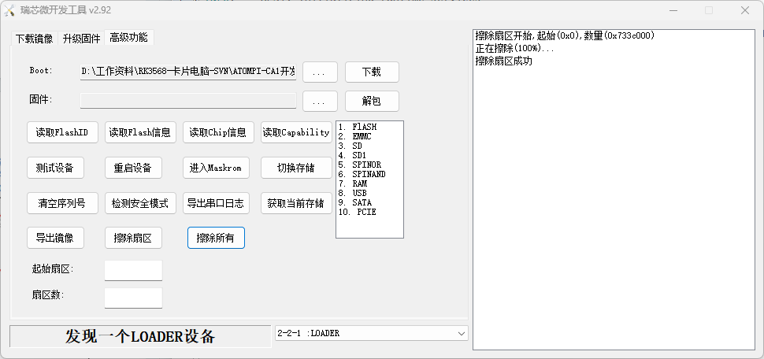 
图2.2.4.2 擦除所有操作

