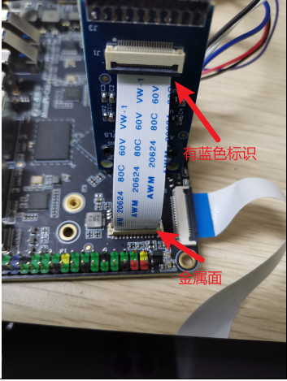
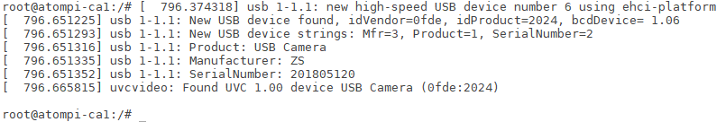
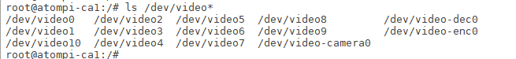

# 3.5 摄像头测试

## 3.5.1 MIPI摄像头

&emsp;&emsp;支持MIPI CSI摄像头，正点原子为此卡片电脑配套三款摄像头分为 IMX415（800W 像素）、IMX335（500W 像素）和 OV13850（1300W 像素）。IMX415 为 8M 像素摄像头可以录制 4K(3840x2160)视频，IMX335 为 5M 像素摄像头可以录制 2K(2592x1944)视频。如下图所示（以imx415为例）。

&emsp;&emsp;**特别注意：imx415需要pcb丝印版本≥V1.5或以上才行，1.5版本以下的线序有差异是不能正常使用的！！！**

<center>

</center>

&emsp;&emsp;执行下面指令采集视频并显示在MIPI屏幕上。IMX415、IMX335和OV13850三款摄像头都适用此命令。**注意：debian系统内App与下面采集视频的指令不能同时使用**。

```c#
gst-launch-1.0 v4l2src device=/dev/video0 ! video/x-raw,format=NV12,width=640,height=480,\
framerate=30/1 ! videoconvert ! ximagesink
```

## 3.5.2 USB摄像头

&emsp;&emsp;同理，实验前请准备 USB 摄像头，符合 UVC（USB video device class）协议的摄像头均可。UVC，全称为：USB video class 或 USB video device class，是 Microsoft 与另外几家设备厂商联合推出的为 USB 视频捕获设备定义的协议标准。符合 UVC 规格的硬件设备在不需要安装其他驱动程序下即可在主机中正常使用。

&emsp;&emsp;插上 USB 摄像头，支持热插拨，串口打印的信息如下。

<center>

</center>

&emsp;&emsp;重新插拔USB设想并查看/dev/video*目录下的节点，来判断哪个节点是摄像头的，笔者的是video9。

<center>

</center>

&emsp;&emsp;执行下面指令采集视频并显示在MIPI屏幕上。**注意：debian系统内App与下面采集视频的指令不能同时使用**。

```c#
gst-launch-1.0 v4l2src device=/dev/video9 ! video/x-raw,format=YUY2,width=640,height=480,\
framerate=30/1 ! videoconvert ! ximagesink
```


