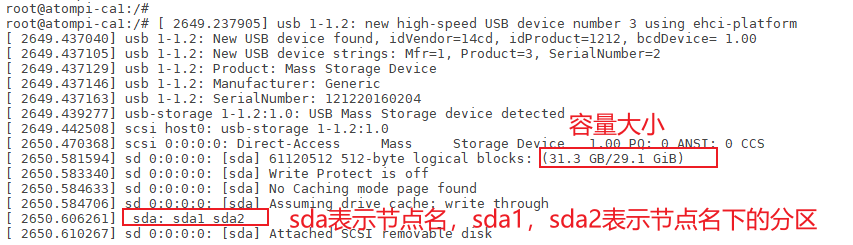
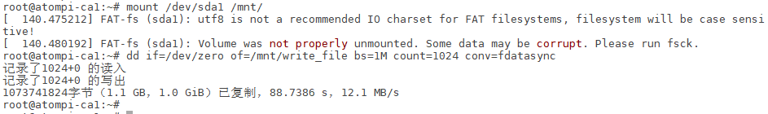
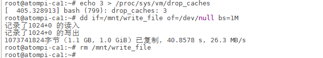

# 3.6 USB&TF卡&EMMC测试

## 3.6.1 USB HOST测试

&emsp;&emsp;本小节就以USB测试来展开测试，TF卡与EMMC测试是与USB测试大致是一样的，只要确认了操作分区即可进行读写速度的测试。

&emsp;&emsp;将一张FAT32格式的U盘用读卡器，直接插在USB接口上（4个USB接口都行，其中两个是USB2.0，两个蓝色接口的是USB3.0如下图。


<center>
<br />
图3.6.1.1 U盘挂载的信息
</center>

## 3.6.2 USB2.0测试

&emsp;&emsp;注意：测试读写速度与个人读卡器或U盘/TF卡的最大读写速度有关。

&emsp;&emsp;写速度测试：

```c#
mount /dev/sda1 /mnt/
dd if=/dev/zero of=/mnt/write_file bs=1M count=1024 conv=fdatasync	
```

<center>

</center>

&emsp;&emsp;使用dd指令读，因为 Linux系统机制，一般情况下不需要特意去释放已经使用的 cache。这些 cache 内容可以增加文件的读写速度。

&emsp;&emsp;执行下面指令清除缓存。

```c#
echo 3 > /proc/sys/vm/drop_caches              #清除缓存
dd if=/mnt/write_file of=/dev/null bs=1M k     #读取速度测试
rm /mnt/write_file                             #读完将此文件删除
```

<center>

</center>

## 3.6.3 USB3.0测试

&emsp;&emsp;在前面说过，Type-C与USB3.0接口是共用的关系，当我们要使用USB3.0接口当主机时，Type-C就不要接连接线。同理，测试方法与3.6.2测试步骤一样。注意：读写速度与U盘速度最大有关。

## 3.6.4 USB2.0 从机测试

&emsp;&emsp;卡片电脑上OTG接口，可当作ADB使用，我们使用一根USB Type-C连接线连接OTG接口到PC(电脑)。使用adb指令就可以与卡片电脑通信了。


