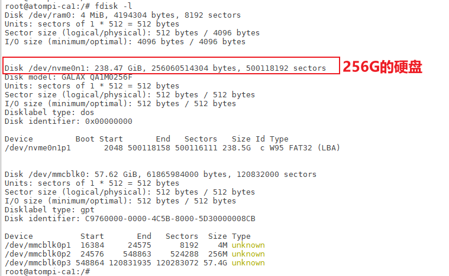
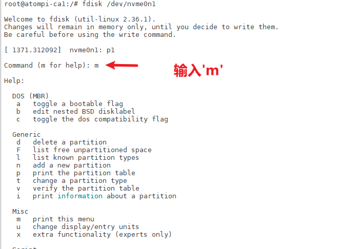
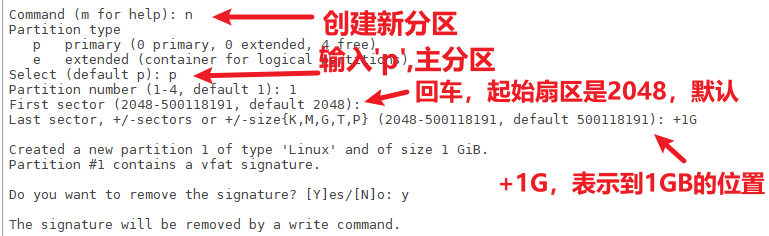
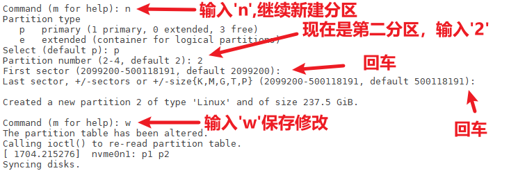
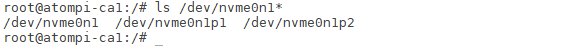
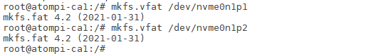
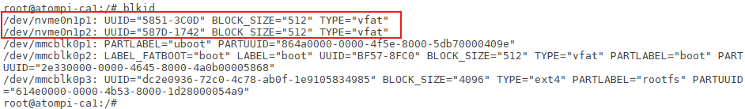

# 3.8 M.2接口测试

&emsp;&emsp;在某些情况下，eMMC存储容量远远不够用时，用户需要扩展存储空间，一种低成本扩大存储容量就是外接硬盘了。

&emsp;&emsp;M.2接口使用PCI Express (PCIe)总线。PCIe是一种高速串行总线，用于连接计算机的内部组件，如显卡、网卡、存储设备等。M.2接口通过PCIe总线提供高速数据传输，支持传输速度高达4 GB/s

&emsp;&emsp;M.2接口在卡片电脑的背面。请使用M.2接口的固态硬盘安装在卡片电脑的背面后（请自备M.2螺丝，一般用户购买M.2硬盘商家都有赠送），建议先断电再插上，然后再开机。

&emsp;&emsp;使用fdisk指令查看硬盘的节点。

```c#
fdisk -l			// “-l”是-L，不是数字“1”。
```

<center>

</center>


&emsp;&emsp;从上图可知，SATA挂载的节点为/dev/nvme0n1，现在开始格式化这个硬盘。如果你的硬盘已经有至少两个分区，那么就会有nvme0n1p1和nvme0n1p2。nvme0n1p1与nvme0n1p2是什么区别？nvme0n1是硬盘的节点，nvme0n1p1是硬盘的第一个分区。笔者这个硬盘有两个分区，若还有其他分区则有nvme0n1p3、nvme0n1p4等等，依次类推。


## 3.8.1 将硬盘分区

&emsp;&emsp;现在我们将这个nvme0n1进行分区，执行下面指令。

```c#
fdisk /dev/nvme0n1
```

&emsp;&emsp;然后可以输入‘m’来查看使用帮助。

<center>

</center>

&emsp;&emsp;常用的选项如下：<br />
&emsp;&emsp;-l：列出所有磁盘的分区表信息；<br />
&emsp;&emsp;-n：创建新分区；<br />
&emsp;&emsp;-d：删除分区；<br />
&emsp;&emsp;-t：修改分区的类型；<br />
&emsp;&emsp;-p：打印分区表；<br />
&emsp;&emsp;-u：以扇区为单位而非柱面为单位来显示和操作分区表；<br />
&emsp;&emsp;-m：使用 DOS 兼容的模式。<br />
&emsp;&emsp;-w：保存修改

&emsp;&emsp;我们输入‘n’，创建一个新分区，然后输入‘p’回车，因为我们这个硬盘分区表格式为MBR格式，支持最大的主分区个数为4个，若输入e的意思是拓展分区可以，可以是无数个逻辑分区。默认起始扇区是2048，本次将第一个分区设置大小为1GB。

<center>

</center>

&emsp;&emsp;现在我们来分第二个分区，也是分做主分区。如下图步骤。这一次我们将起始位置默认为“2099200”了。因为这个位置刚好是前一个分区的末端。最后一个扇区作为终止位置，也就是说硬盘最大容量减去1GB的大小作为第二个扇区。最后不要忘记输入‘w’来保存修改，否则无法生效。当然你继续分区，根据你自己的需要，主分区只能分4个，扩展分区可以无数多个，之后再保存修改就可以了。

<center>

</center>

&emsp;&emsp;好了，我们分区完成了，现在需要查看分区是否成功。可以看到下图有两个分区，nvme0n1p1与nvme0n1p2说明分区成功。

```c#
ls /dev/nvme0n1*
```

<center>

</center>


## 3.8.2 格式化分区

&emsp;&emsp;将硬盘分区之后，需要进行格式化。现在我们开始对nvme0n1分区进行格式化。使用的是vfat格式，vfat格式是fat格式的扩展，这里你可以选择ext4格式，但是这种格式在Windows下不能被识别。

&emsp;&emsp;当然你可以格式化为ntfs格式，文件系统已经支持。注意不是所有的Linux文件系统都支持NTFS，虽然能支持挂载NTFS的文件系统类型，但是在Linux内核上是不支持NTFS格式的。简单来说，能支持NTFS是软件层适配的，不是内核层！

```c#
mkfs.ntfs /dev/nvme0n1p1 -Q // 快速格式化为NTFS格式
mkfs.vfat /dev/nvme0n1p1
mkfs.ext4 /dev/nvme0n1p1
```

&emsp;&emsp;本次将格式化为vfat格式。这样Windows可以访问，Linux也可以识别。格式化前面分的两个主分区，若你分了多个区，道理也是一样。

```c#
mkfs.vfat /dev/nvme0n1p1
mkfs.vfat /dev/nvme0n1p2
```

<center>

</center>

&emsp;&emsp;格式化完成了重启卡片电脑。使用blkid指令查看分区硬盘格式，可以看到为“vfat”格式。注意，如果格式为“ntfs”格式，这里是看不到的，因为Linux识别不了这一种类型。

```c#
blkid
```

<center>

</center>


