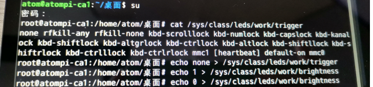

# 4.1 LED测试

&emsp;&emsp;正点原子卡片电脑上有配备一个用户LED。它们在底板原理图对应硬件管脚的关系如下表。在出厂系统里，我们把LED作为心跳灯，一般用于指示系统是否正常运行。

<div class="ca1_center-table-div">
<table class="ca1_center-table">
  <tr>
    <th>管脚名称</th>
    <th>PI0</th>
  </tr>
  <tr>
    <td>卡片电脑</td>
    <td>GPIO0_C3</td>
  </tr>
</table>
</div>


&emsp;&emsp;使用鼠标右键点击桌面，点击‘在此打开终端’，进到终端模式，如下图所示：

<center>

</center>

&emsp;&emsp;在出厂系统里，我们需要先进入到root模式，密码为root，再通过如下指令来控制LED状态。输入后查看卡片电脑上的LED的状态。

```c#
su                                         #填写root用户密码
cat /sys/class/leds/work/trigger           #查看触发方式及触发方式，默认为[heartbeat]
echo none > /sys/class/leds/work/trigger   #改变LED0的触发模式
echo 1 > /sys/class/leds/work/brightness   #点亮LED0，此时为常亮状态，取值为1~255
echo 0 > /sys/class/leds/work/brightness   #熄灭LED0，此时为熄灭状态，取值为0
```

<center>

</center>


