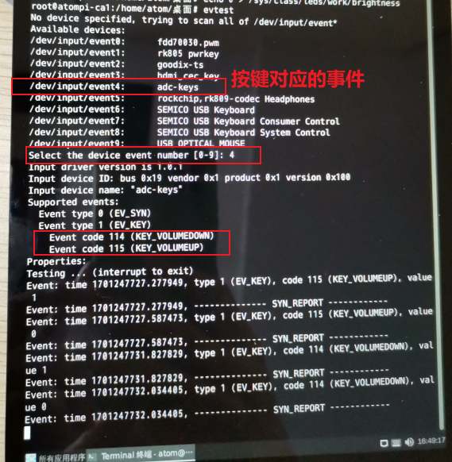
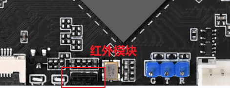
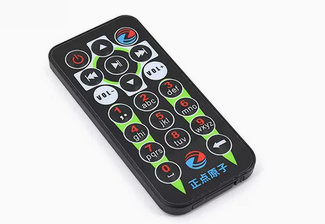
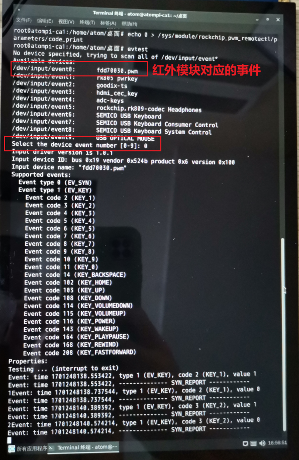

# 4.2 evtest测试

&emsp;&emsp;正点原子卡片电脑上有配备4个按键。其中2个按键是用ADC0模拟，按键按下去会有对应的数值反馈。ADC0有不同的电压变化。

<div class="ca1_center-table-div">
<table class="ca1_center-table">
  <tr>
    <th>按键的名称</th>
    <th>V+</th>
    <th>V-</th>
  </tr>
  <tr>
    <td>code值</td>
    <td>115</td>
    <td>114</td>
  </tr>
</table>
</div>


&emsp;&emsp;在终端下运行以下命令进行测试，然后输入对应的数字，这里输入的是“4”，因为按键事件为event4。如果此时卡片电脑接上了鼠标或者键盘，那么按键事件对应的值会发生改变，请填写对应的事件值。如需要停止测试按Ctrl + c。请按下卡片电脑上的以上两个键，请不要按到其他键，如复位键REST等。

```c#
evtest
```

&emsp;&emsp;运行结果如下所示，可以看到按对应的按键就会打印对应的按键类型和按下时值为1，松开即为0。

<center>

</center>

## 4.2.2红外模块测试

&emsp;&emsp;板载红外模块底板丝印位置，如下图。

<center>

</center>

&emsp;&emsp;我们需要找到一个红外遥控器（红外遥控器属于非卡片电脑配件，请自行配备），比如正点原子店铺的红外遥控模块，如果你手头上有其它红外遥控器也可以测试。注意不同遥控器编码可能不一样。如下图，此模块为正点原子店铺一个红外遥控器，常用于stm32板卡上，我们卡片电脑已经将它的红外编码解码为对应的按键或者功能键了。例如输入数字“1”，就能识别为数字“1”。

<center>

</center>


&emsp;&emsp;现在我们执行下面的指令来测试这个遥控器。

&emsp;&emsp;先关闭打印信息，再执行测试。

```c#
echo 0 > /sys/module/rockchip_pwm_remotectl/parameters/code_print
evtest
```

&emsp;&emsp;运行结果如下所示，可以看到按对应的按键就会打印对应的按键类型和按下时值为1，松开即为0，可以看出对应的按键已经被解码成对应的数值。

<center>

</center>


