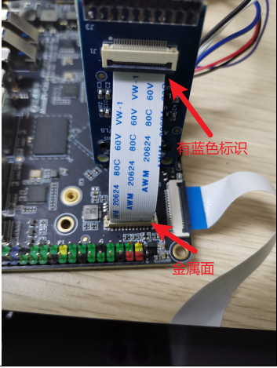
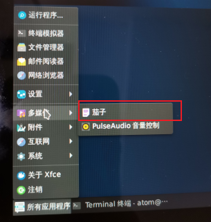
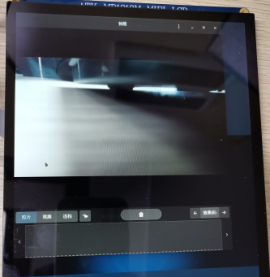

# 4.4 摄像头测试

&emsp;&emsp;支持MIPI CSI摄像头和USB 摄像头，符合 UVC（USB video device class）协议的摄像头均可，正点原子为此卡片电脑配套三款摄像头分为 IMX415（800W 像素）、IMX335（500W 像素）和 OV13850（1300W 像素）。IMX415 为 8M 像素摄像头可以录制 4K(3840x2160)视频，IMX335 为 5M 像素摄像头可以录制 2K(2592x1944)视频。如下图所示（以imx415为例）。

&emsp;&emsp;**特别注意：imx415需要pcb丝印版本≥V1.5或以上才行，1.5版本以下的线序有差异是不能正常使用的！！！**

&emsp;&emsp;摄像头测试我们采用系统内的APP来实测，点击左下角【所有应用程序】->【多媒体】->【茄子】。此APP可以实现拍照、录制视频和连拍功能

