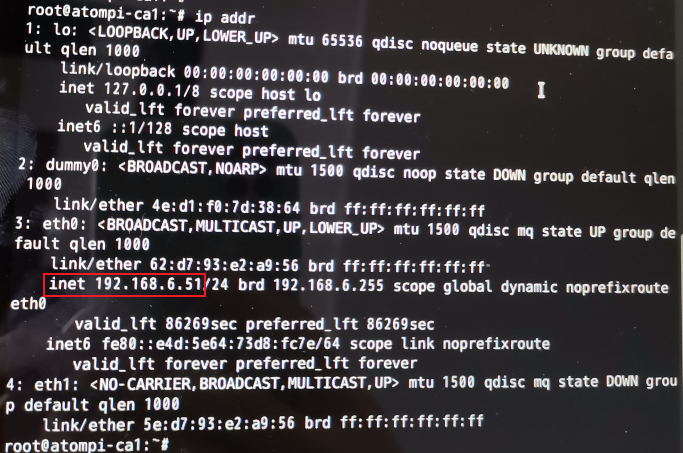
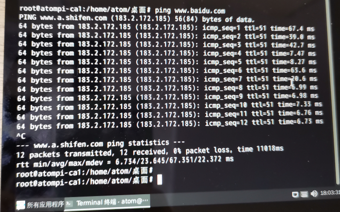
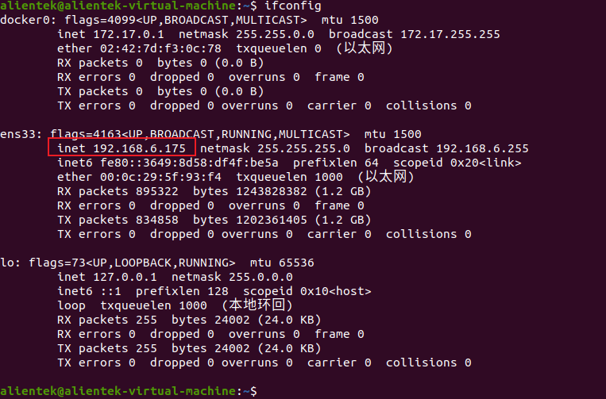
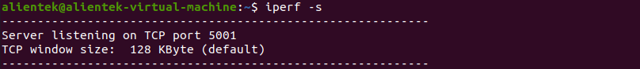
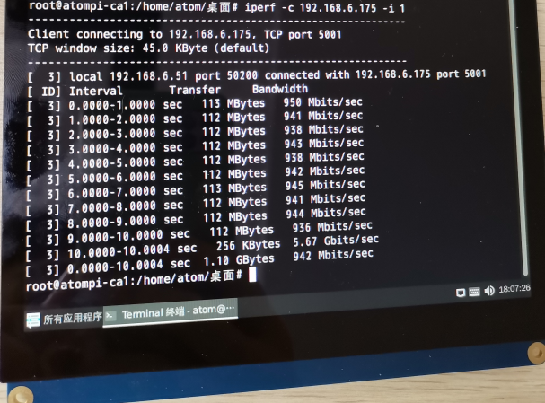
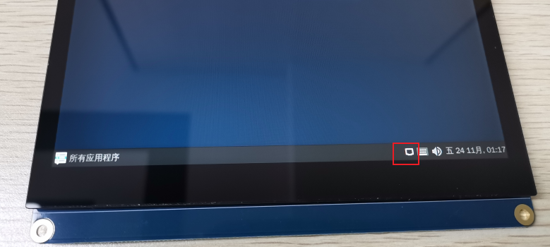
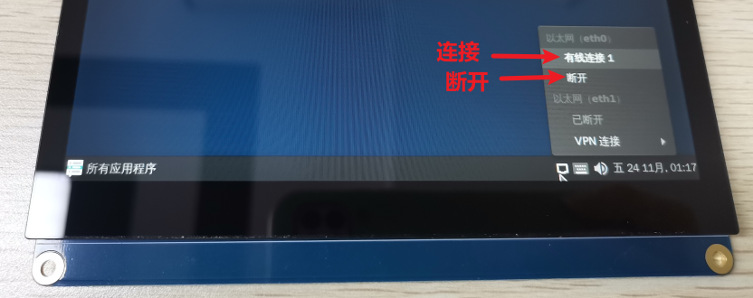

# 4.5 网络测试

&emsp;&emsp;卡片电脑上搭载两颗千兆网络芯片，自适应10/100/1000M。在文件系统使用如下指令测试网络，将网线插在两个网口其中一处，确保网线能上网。查看网络获取的IP。

&emsp;&emsp;**注意：实验的环境是板子需要直连路由器！**

## 4.5.1终端命令行模式

&emsp;&emsp;使用ip addr命令来查看当前的IP地址。

```c#
ip addr
```

<center>
<br />
图4.5.1.1 eth0获取到IP地址
</center>

&emsp;&emsp;检查网络能否上网，如果有数据回复，则说明网络功能正常。按Ctrl+c终止指令。

```c#
ping www.baidu.com
```

<center>
<br />
图4.5.1.2 ping通百度
</center>

&emsp;&emsp;同时另一网口也是这样测试，将网线插到另一网口，重复以上操作。

&emsp;&emsp;测试是否为千兆网络，注意要使用千兆网线，千兆路由器（普通家用路由大多为百兆的）或者千兆交换机，PC（电脑）网卡必须是千兆网卡，否则测试出来的速度或识别出来的速度可能是百兆的！

&emsp;&emsp;使用iperf指令可测试千兆网络的连接速度

&emsp;&emsp;设置Ubuntu为服务器，Ubuntu和卡片电脑必须在同一局域网内。若Ubuntu没有iperf指令则需要输入sudo apt install iperf来安装。

&emsp;&emsp;查看Ubuntu IP

```c#
ifconfig
```

<center>

</center>

&emsp;&emsp;输入iperf -s，将Ubuntu设置为服务器。

```c#
iperf  -s
```

<center>

</center>

&emsp;&emsp;ATOMPI-CA1为客户端，通过iperf命令，输入服务器（Ubuntu）的IP即可。

```c#
iperf -c 192.168.6.175 -i 1
```

&emsp;&emsp;命令解析：<br />
&emsp;&emsp;-s：表示当前设备做服务器。<br />
&emsp;&emsp;-c：表示当前设备做客户端。<br />
&emsp;&emsp;192.168.6.175：服务器的IP地址。<br />
&emsp;&emsp;-i：触发周期。

<center>
<br />
图4.5.1.5 iperf测试结果
</center>

&emsp;&emsp;测试出来的Bitrate收发都大概为942 Mbits/sec左右才是千兆网络速度(测试前请不要开启其他应用，以免影响测试速度)，如果不是，请检查是否使用了千兆网线、PC电脑的网卡是不是千兆网卡，通过的路由器是不是千兆的等，不能有一个为百兆的设备，否则测试出来的是百兆网络。

## 4.5.2 屏幕网络操作

&emsp;&emsp;Debian系统桌面右下角有个“电脑”图标，这个就是界面上控制网络连接的地方。

<center>
<br />
图4.5.2.1 debian系统桌面
</center>

&emsp;&emsp;点击图标，点击“有线连接1”可以自动联网；点击“断开”，可以断开网络连接。

<center>
<br />
图4.5.2.2 debian系统桌面
</center>


