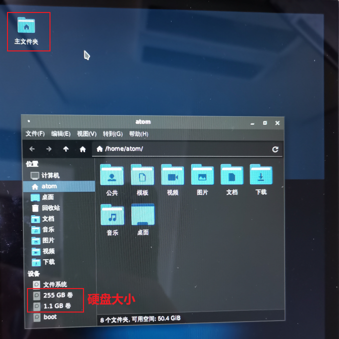

# 4.6 M.2接口测试

&emsp;&emsp;在某些情况下，eMMC存储容量远远不够用时，用户需要扩展存储空间，一种低成本扩大存储容量就是外接硬盘了。

&emsp;&emsp;M.2接口使用PCI Express (PCIe)总线。PCIe是一种高速串行总线，用于连接计算机的内部组件，如显卡、网卡、存储设备等。M.2接口通过PCIe总线提供高速数据传输，支持传输速度高达4 GB/s

&emsp;&emsp;M.2接口在卡片电脑的背面。请使用M.2接口的固态硬盘安装在卡片电脑的背面后（请自备M.2螺丝，一般用户购买M.2硬盘商家都有赠送），建议先断电再插上，然后再开机。

&emsp;&emsp;本实验接上一个M.2接口256G的硬盘，点击【左上角主文件夹】可以看出硬盘已经挂载上，如下图所示：

