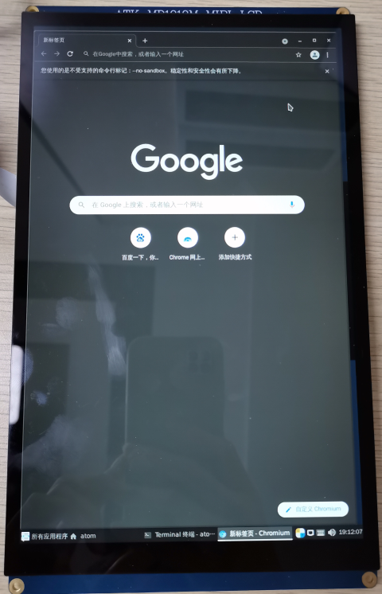
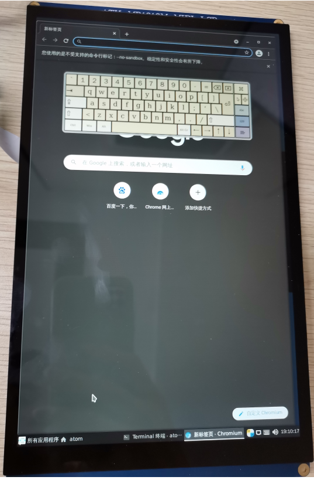

# 4.9 网页上网

&emsp;&emsp;点击左下角【所有应用程序】->【互联网】->【Chromium Browser】就可以打开一个系统自带的一个网页，如下图所示：

&emsp;&emsp;如果卡片电脑没有接上鼠标和键盘，那么可以把MIPI 10.1寸屏当作一个平板，但此时是没有虚拟键盘，此时我们就需要打开虚拟键盘，点击左下右 **【所有应用程序】->【附件】->【Onboard** 就可以打开一个好用的虚拟键盘。如下图所示：

